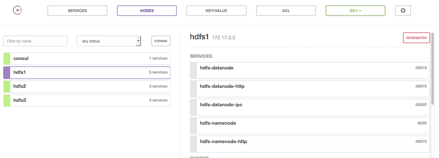

# alpn-hdfs

Alpine image holding HDFS

## Hello World

To spin up the HDFS stack just use `docker-compose`

```
➜  alpn-hdfs git:(master) ✗ docker-compose up -d
Creating hadoop-consul
Creating hdfs3
Creating hdfs2
Creating hdfs1
➜  alpn-hdfs git:(master) ✗
```

Now we can hook into the first node and copy a file - but **give it a couple of seconds** to settle.



Consul (`<docker-host>:8500`) should glow green after a while...

```
➜  alpn-hdfs git:(master) ✗ docker exec -ti hdfs1 bash
bash-4.3# su -c '/opt/hadoop/bin/hadoop fs -mkdir /test' hadoop
bash-4.3# su -c '/opt/hadoop/bin/hadoop fs -copyFromLocal /etc/hosts /test/' hadoop
```

In case you got an connection error, just wait a bit...

```
bash-4.3# su -c '/opt/hadoop/bin/hadoop fs -mkdir /test' hadoop
mkdir: Call From hdfs1/172.17.0.3 to hdfs1:8020 failed on connection exception: java.net.ConnectException: Connection refused; For more details see:  http://wiki.apache.org/hadoop/ConnectionRefused
```

This file can be accessed from one of the others...

```
➜  alpn-hbase git:(master) ✗ docker exec -ti hdfs3 /opt/hadoop/bin/hadoop fs -ls /test/
Found 1 items
-rw-r--r--   1 hadoop supergroup        238 2016-05-03 09:58 /test/hosts
➜  alpn-hbase git:(master) ✗
```